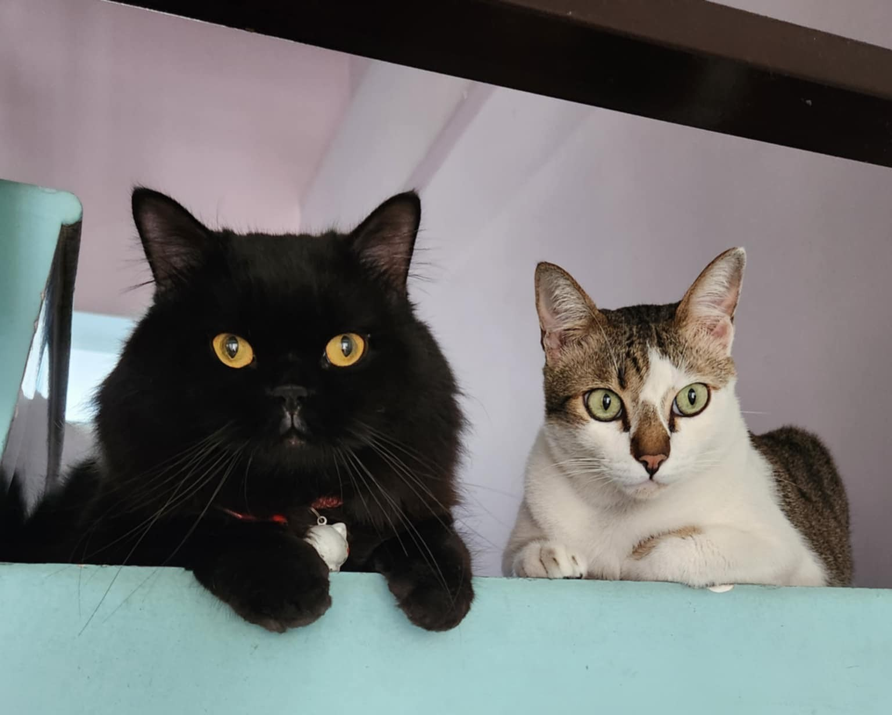

## Some stuff about me

-   My name is actually **Y**, but I believe it is easier for many foreign friends to call me by my middle name, **Minh**. Though if you come visit my hometown and ask people around about Minh, you would probably never find me.

-   I'm a huge fan Vietnamese goi cuon, Korean kimchi, and French croissants.

-   My recent favorite series is *Peaky Blinders*. Finished all 6 seasons in one week.

## Education

| Degree               | Year      | Institution                        | Country |
|:-----------------|:-----------------|:-----------------|:-----------------|
| Master 2 GenE2       | 2024–2025 | Université Paris-Saclay            | France  |
| BSc in Biotechnology | 2020–2024 | International University – VNU-HCM | Vietnam |

## Find me

-   <i class="fa-solid fa-envelope"></i> [minh-y.tran\@universite-paris-saclay.fr](mailto:minh-y.tran@universite-paris-saclay.fr)
-   <i class="fa-brands fa-linkedin"></i> [LinkedIn](https://www.linkedin.com/in/tranminhy)
-   <i class="fa-solid fa-location-dot"></i> Ho Chi Minh City, Vietnam

  
  My two little brothers

